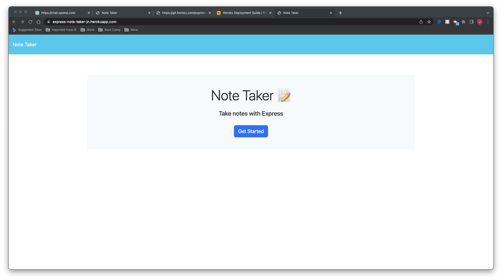
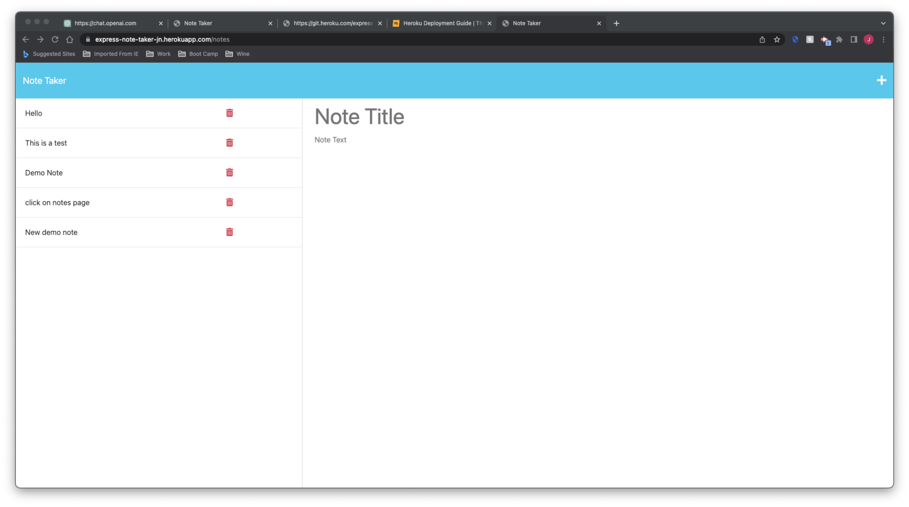
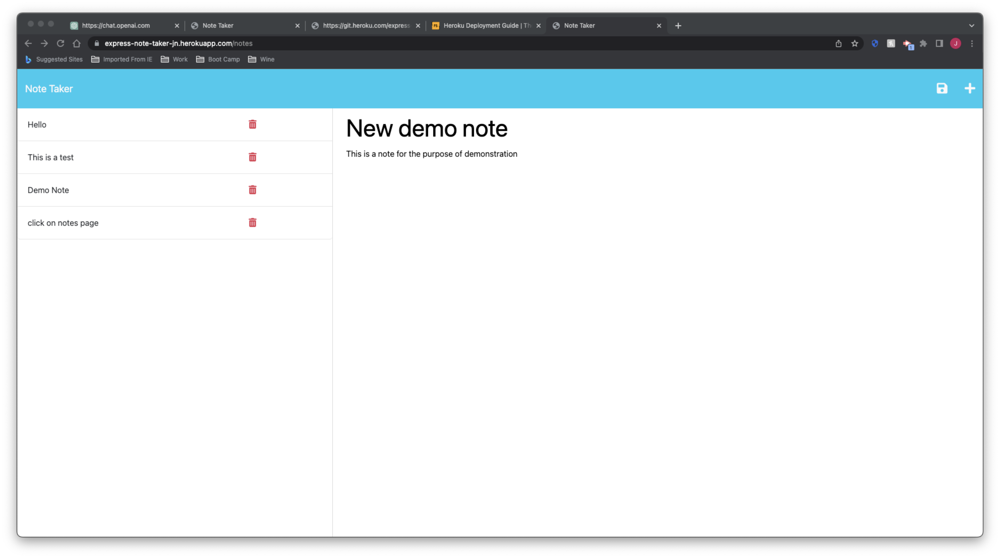

# 11 Express.js: Jenny's Note Taker 

## Description

My task is to modify starter code to create an application called Note Taker that can be used to write and save notes. This app is designed for a small business owner to be able to write and save notes, to be able to organise their thoughts and keep track of tasks that need completion. This application will use an Express.js back end and will save and retrieve note data from a JSON file. It will connect to the already provided starter code and be deployed to Heroku.

## Usage

The note taker app has a landing page which links to a notes page. The existing notes appear on the left-hand column and there is an empty field on the right hand side to add notes.

When you enter a new note into the title and text fields, a save icon appears in the navigation at the top of the page. This then saves the note and it appears on the left-hand side column.

When the existing notes are clicked they appear on the right-hand column. The 'Write' icon (in the navigation bar) presents a empty fields to the user to enter a new note. 

When the user clicks on the bin icon the note is then deleted from the left hand column.

You can use this app by clicking on the link to the deployed application:  https://express-note-taker-jn.herokuapp.com/ 

## Screenshot

The following screenshots show my web application's appearance and functionality:

Landing page:

Notes Page:

Writing a note (app functionality):

## Credits

* [Heroku deployment guide](https://coding-boot-camp.github.io/full-stack/heroku/heroku-deployment-guide).
* [express.router](https://expressjs.com/en/guide/routing.html#express-router)
* [express.json](https://expressjs.com/en/4x/api.html#express.json)
* [Insomnia](https://insomnia.rest/download)
* [Insomnia](https://expressjs.com/)
* [Node.js Path Module](https://nodejs.org/api/path.html)
* [Javascript Promises](https://www.digitalocean.com/community/tutorials/understanding-javascript-promises)
* Demos:
 
 

## License

Please refer to the LICENSE in the repo or click on the badge for documentation.

